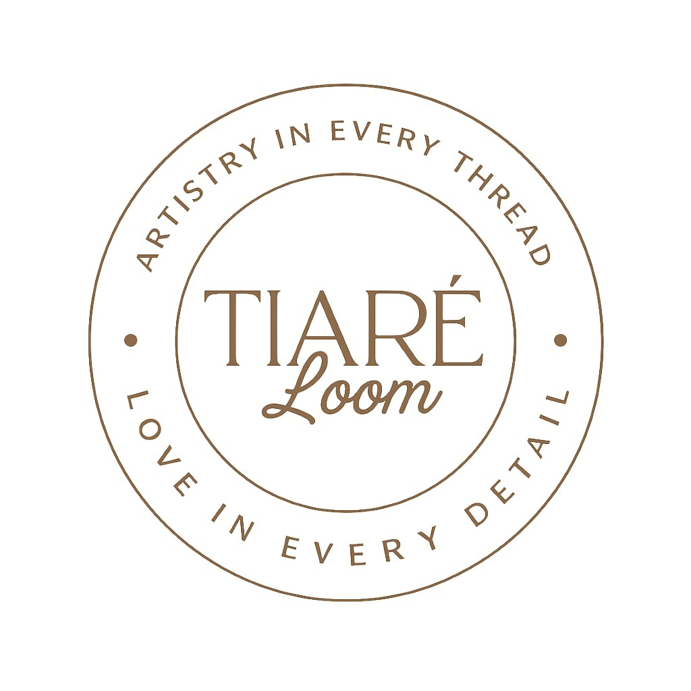
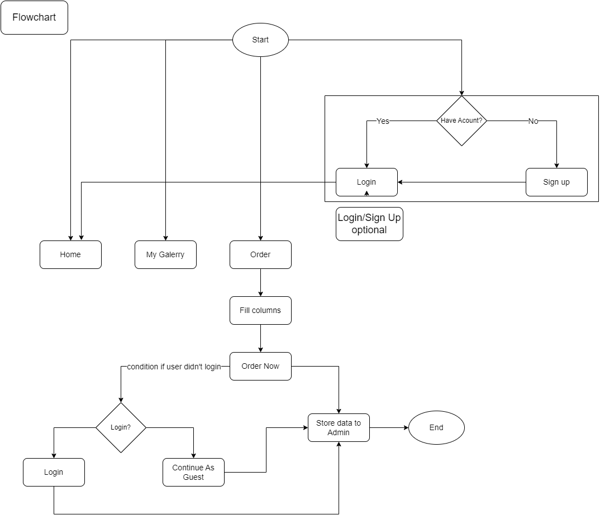
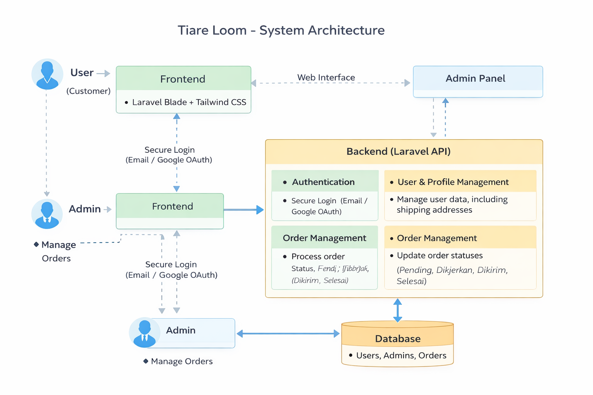

## About Laravel

Laravel is a web application framework with expressive, elegant syntax. We believe development must be an enjoyable and creative experience to be truly fulfilling. Laravel takes the pain out of development by easing common tasks used in many web projects, such as:

- [Simple, fast routing engine](https://laravel.com/docs/routing).
- [Powerful dependency injection container](https://laravel.com/docs/container).
- Multiple back-ends for [session](https://laravel.com/docs/session) and [cache](https://laravel.com/docs/cache) storage.
- Expressive, intuitive [database ORM](https://laravel.com/docs/eloquent).
- Database agnostic [schema migrations](https://laravel.com/docs/migrations).
- [Robust background job processing](https://laravel.com/docs/queues).
- [Real-time event broadcasting](https://laravel.com/docs/broadcasting).

Laravel is accessible, powerful, and provides tools required for large, robust applications.

## Learning Laravel

Laravel has the most extensive and thorough [documentation](https://laravel.com/docs) and video tutorial library of all modern web application frameworks, making it a breeze to get started with the framework. You can also check out [Laravel Learn](https://laravel.com/learn), where you will be guided through building a modern Laravel application.

If you don't feel like reading, [Laracasts](https://laracasts.com) can help. Laracasts contains thousands of video tutorials on a range of topics including Laravel, modern PHP, unit testing, and JavaScript. Boost your skills by digging into our comprehensive video library.

## Laravel Sponsors

We would like to extend our thanks to the following sponsors for funding Laravel development. If you are interested in becoming a sponsor, please visit the [Laravel Partners program](https://partners.laravel.com).

### Premium Partners

- **[Vehikl](https://vehikl.com)**
- **[Tighten Co.](https://tighten.co)**
- **[Kirschbaum Development Group](https://kirschbaumdevelopment.com)**
- **[64 Robots](https://64robots.com)**
- **[Curotec](https://www.curotec.com/services/technologies/laravel)**
- **[DevSquad](https://devsquad.com/hire-laravel-developers)**
- **[Redberry](https://redberry.international/laravel-development)**
- **[Active Logic](https://activelogic.com)**

## Contributing

Thank you for considering contributing to the Laravel framework! The contribution guide can be found in the [Laravel documentation](https://laravel.com/docs/contributions).

## Code of Conduct

In order to ensure that the Laravel community is welcoming to all, please review and abide by the [Code of Conduct](https://laravel.com/docs/contributions#code-of-conduct).

## Security Vulnerabilities

If you discover a security vulnerability within Laravel, please send an e-mail to Taylor Otwell via [taylor@laravel.com](mailto:taylor@laravel.com). All security vulnerabilities will be promptly addressed.

## License

The Laravel framework is open-sourced software licensed under the [MIT license](https://opensource.org/licenses/MIT).

Laravel is accessible, powerful, and provides tools required for large, robust applications.

## About Tiare Loom

**Tiare Loom** is a dedicated e-commerce and portfolio platform designed for a boutique brand specializing in handcrafted beads bags. This application serves as a digital storefront where customers can explore the artisan's gallery, place custom orders, and manage their profiles.

## Flowchart Diagram

This flowchart diagram explains the user workflow. Users can place orders without having to log in or register first. However, for a more personalized experience, they can create an account to access additional features such as saving shipping addresses and viewing order history.
**Condition**: **IF** the user is not logged in, they can only place orders without saving shipping addresses. **ELSE**, if the user is logged in, they can save shipping addresses and view order history.
**BUT** when the user not logged but they order, after user click **Order Now** there's a **Modal** that ask user to login or continue as guest.

## Diagram Explanation

The diagram illustrates the high-level architecture and user flow of the **Tiare Loom** application. It outlines the interactions between the two main actors (User and Admin) and the core system components.

**1. Actors & Core Interaction:**

*   **User (Customer)**: Interacts with the public-facing website. They can register, log in (using email/password or Google), view the product gallery, manage their profile and addresses, and place custom orders.
*   **Admin**: Manages the application's backend through a dedicated admin panel. Their primary role is to oversee and process incoming orders.

**2. System Flow:**

*   **Frontend**: The user-facing part of the application, built with Laravel Blade and styled with Tailwind CSS. This is where users browse the gallery and manage their accounts.
*   **Backend (Laravel API)**: The core logic of the application. It handles:
    *   **Authentication**: Manages secure login for both users and admins. It also integrates with Google's OAuth service for social logins.
    *   **User & Profile Management**: Handles user data, including personal information and shipping addresses.
    *   **Order Management**: Processes order creation, and allows the admin to update order statuses (e.g., from `Pending` to `Dikerjakan`, `Dikirim`, and `Selesai`).
*   **Database**: The central repository for all application data, including `users`, `admins`, `orders`, and other related information.

This flow ensures a clear separation between the customer's shopping experience and the administrative tasks, creating a robust and manageable e-commerce system.

### Key Features

-   **Artisan Showcase**: A beautiful landing page featuring the artisan's story ("From Passion to Product") and a dynamic gallery of past works integrated via LightWidget.
-   **User Accounts**: Secure registration and login system, including **Google OAuth** integration for seamless access.
-   **Profile Management**: Users can manage their personal information, save detailed shipping addresses (Province, City, District, Village), and view order history.
-   **Custom Orders**: Functionality for users to browse and request custom-made bags tailored to their preferences.
-   **Responsive Design**: Built with **Tailwind CSS** to ensure a modern and responsive experience across all devices.

### Installation

1.  Clone the repository.
2.  Install PHP dependencies: `composer install`.
3.  Install frontend dependencies: `npm install && npm run build`.
4.  Copy the environment file: `cp .env.example .env`.
5.  Configure your database and Google Client credentials in the `.env` file.
6.  Generate the application key: `php artisan key:generate`.
7.  Run migrations and seeders: `php artisan migrate --seed`.
8.  Start Vite: `npm run dev`.
9.  Start the local server: `php artisan serve`, or use **Laragon** just click **Start** button.

## Learning Laravel

Laravel has the most extensive and thorough documentation and video tutorial library of all modern web application frameworks, making it a breeze to get started with the framework. You can also check out Laravel Learn, where you will be guided through building a modern Laravel application.
